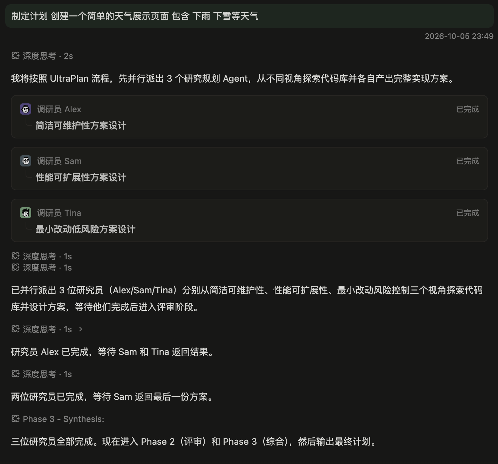

# Expert Team Planning Timeline Plan

Status: ready for user testing; local implementation and applicable checks complete. Revision `team-timeline-v1`, 2026-10-07, Asia/Taipei.

## Baseline

- Base: `origin/main` = `ea54319c379e77e6117c828f10abf8d4f25c1ab3`. Line numbers below are at this commit.
- Plan branch: `docs/team-planning-timeline-plan` (this file and the reference image only).
- Reference image (user screenshot, 1421x1324 px):
  `assets/expert-team-planning-timeline/references/reference-01.png`

  

- Related plan: `2026-10-06-expert-team-visual-parity.md` owns the card, identity and status visuals
  (already on main). This plan changes only where cards and process rows sit inside a team turn.
- Implementation branch: `feat/team-planning-timeline`, worktree `../PI-Desktop-worktrees/team-planning-timeline`,
  created from the latest `origin/main` when work starts.

## 1. Goal and non-goals

Goal: in an Expert Team turn the user reads one chronological timeline (thinking rows, the lead's narration,
dispatch cards at the moment of dispatch) instead of a collapsed "Processed for Ns" fold with the cards
appended at the end.

```text
BEFORE (main)                               AFTER (this plan)
user bubble + time                          user bubble + time
trailing narration only                     thinking row
> Processed for 41s, 9 tools (folded)       narration
PlanApprovalBar                             card Alex / card Sam / card Tina
card Alex / card Sam / card Tina            thinking rows
joining row (live)                          narration
                                            PlanApprovalBar (after its own section)
                                            live tail: thinking row, runtime row or joining row
```

Non-goals:

- No Team runtime, IPC, host-core, shared-contract or lead-prompt change; the launch-review gate is untouched.
- No new setting, persisted field, i18n key or ADR (no frozen boundary, contract or ownership change).
- Non-team turns render exactly as today.
- No change to card visuals, identity projection, snapshot merge or single-target navigation.
- No thinking copy rename and no thinking-title rows (OD3, OD4). Inline `AskToolCompletedSummary` is deferred (K3).

## 2. Reference inventory (top to bottom)

| # | Element in the reference | State on main |
| --- | --- | --- |
| 1 | User bubble, timestamp right-aligned below | parity (`MessageTimestamp`) |
| 2 | Thinking row, icon plus muted label (`深度思考 · 2s`) | exists as a thinking group, but folded; copy differs (OD3) |
| 3 | Lead narration paragraph | folded unless it is the trailing message |
| 4 | Three dispatch cards stacked (role and name, task title, status) | visuals at parity; rendered at turn end |
| 5 | Two thinking rows stacked, then narration | folded |
| 6 | Thinking row, narration, thinking row, narration (repeated) | folded |
| 7 | Last thinking row titled from the thought heading, then narration | title extraction out of scope (OD4) |

## 3. Why main differs (evidence)

| Gap | Evidence | Effect |
| --- | --- | --- |
| Only the trailing message is shown; everything else is folded | `AssistantTurn.tsx:393-412` renders `responses` above `TurnProcess`; `getAssistantTurnSummary` in `lib/transcript-summary.ts` puts only the trailing content message in `responses`; `TurnProcess.tsx` opens only while the turn is active | narration and thinking vanish after the turn settles |
| Cards appended at the end | `AssistantTurn.tsx:420-422`, after all sections and the `PlanApprovalBar` | cards lose their place in the story |
| Raw `task_create` rows duplicate the cards | no row filtering; `ActivityGroup.tsx` renders every item | duplicate information inside the fold |
| A flat renderer already exists | `AssistantTurnParts` renders parts in order; the non-grouped branch (`AssistantTurn.tsx:413-416`) is dead because `shouldGroupTurnProcess` is always true (`lib/turn-process.ts:53`) | reuse `AssistantTurnParts`; do not revive or delete the dead branch (B8) |

Alternatives rejected: (a) keep `TurnProcess` and draw cards inside it: still collapses and hides narration;
(b) count every message as a response in `getAssistantTurnSummary`: changes every turn, breaks B1;
(c) draw cards inside `ActivityGroup`: grows a 632-line module and cannot un-fold narration.

## 4. Design

### 4.1 Gate

`projectTeamTimeline` returns `null` unless at least one message of the turn is a card anchor
(`index.cardsByMessageId.has(message.id)`, checking activity items and message parts like the lookup at
`AssistantTurn.tsx:342-367`). `null` keeps today's JSX path untouched. The dispatch index stays the only
source of truth for what a card is; the projection never inspects tool names or results.

### 4.2 Projection (pure, React-free: `apps/desktop/src/lib/team-timeline.ts`)

```ts
export type TeamTimelineSegment =
  | { kind: "parts"; key: string; parts: AssistantTurnPart[] }
  | { kind: "cards"; key: string; cards: TeamDispatchCardItem[]; joining: boolean };

export type TeamTimeline = {
  sections: TeamTimelineSegment[][];          // aligned with the input sections
  parts: AssistantTurnPart[];                 // every projected part in order
  activePart: AssistantTurnPart | undefined;  // live tail, rule P7
};

export function projectTeamTimeline(
  sections: readonly { parts: readonly AssistantTurnPart[] }[],
  index: TeamDispatchIndex,
  opts: { active: boolean; joining: boolean },
): TeamTimeline | null;
```

Rules:

- P1 Order. Sections and parts keep input order. Only activity parts are split and card segments inserted;
  message parts pass through by identity. A `parts` segment is the maximal run of plain parts between two
  cards segments.
- P2 Anchor. An activity item is an anchor when `item.kind === "tool"` and the index has its message id
  (this includes a task first seen through `task_update`; the index decides). A failed or unparsed
  `task_create` is not in the index, so its raw row stays. The test lives in one function so OD2 is a
  one-line change.
- P3 Run. Inside one activity part a run starts at an anchor and continues across later non-anchor `tool`
  items; a `thinking` or `hostedSearch` item or the end of the part ends it. The run yields one cards
  segment at its first anchor. Non-anchor tool items inside the run keep their relative order and render
  right after the cards (hoisted, never dropped).
- P4 Split. Items before the run form the head part; hoisted tools plus everything after the run form the
  tail part. A part without an anchor passes through by reference. A head gets `endedAt` = `createdAt` of
  its run's first anchor message; the last tail keeps the source part's `endedAt`.
- P5 Dedupe. A card appears at most once per turn (turn-wide set keyed by team session id and task id).
  A run that yields no new card emits no segment; its anchor rows are still absorbed.
- P6 Joining. With `opts.joining`, the last segment of the last section gets `joining: true` if it is a
  cards segment; otherwise a trailing cards segment with an empty list and `joining: true` is appended.
  With no anchors the gate returns `null` and the caller keeps today's joining-only group.
- P7 Active tail. `activePart` is the last part of the last section only when `opts.active` and the last
  segment is a `parts` segment; otherwise `undefined`, so an earlier finished group never looks live.
- P8 Stability. For unchanged source parts and anchors, successive projections return `===` part objects
  (cache split pieces in a `WeakMap` keyed by the source part plus an anchor signature). Segment keys come
  from the first source message id of the segment and stay stable while items append.
- P9 Invariants (test-enforced). Every card anchored in the turn appears exactly once; every non-anchor
  item appears exactly once, in original order except for the P3 hoist; no empty `parts` segment and no
  activity part with zero items.

### 4.3 Renderer and wiring

- `TeamTimeline.tsx` (new, a fragment): maps segments; `parts` renders the existing `AssistantTurnParts`,
  `cards` renders the existing `TeamDispatchCardsGroup`. Live row: when the turn is active, this is the last
  section, the last segment is cards with `joining === false` and `runtimeActivity` exists, render one
  `role="status"` line with `runActivityLabel(runtimeActivity, t)` (already exported from
  `ActivityGroup.tsx:121`), styled like the existing running label. No timer and no new copy.
- `AssistantTurn.tsx`: (1) delete the `turnDispatchCards` memo (`:339-370`, keep `dispatchIndex` at `:338`);
  it can only be non-empty when the projection is non-null, and the legacy path keeps
  `joining ? group(cards=[]) : null`;
  (2) compute `timeline` with `useMemo` over `sections`, `dispatchIndex`, `isActive`, `teammateJoining`;
  (3) when `timeline` exists, derive `renderedParts`, `activePart` and `lastActivityPart` from it, never from
  the pre-projection list, because `AssistantTurnParts` compares by identity (`part === activePart`);
  (4) per section, `timeline` renders `completedAsks` (placement unchanged) then `TeamTimeline` in place of
  the `responses` plus `TurnProcess` pair; `PlanApprovalBar`, `generatedImages`, meta and actions unchanged.
- `AssistantTurnParts.tsx`: export the private `PartContext` type only.
- `TeamDispatchCard.tsx`: add `data-message-id={card.firstCreateMessageId}` on the card root so transcript
  search (`use-transcript-search-focus.ts` looks up `[data-message-id]`) lands on the card for an absorbed row.
- `team-dispatch.css`: reuse tokens; segments get no wrapper element (keeps `.message-col >` selectors valid);
  consecutive thinking rows stack tightly; the cards group keeps its 8px block margin and 12px gap. Add only
  what the harness shows is needed (the live row). Pixel tuning is left to the executor.
- `ActivityGroup` already works without a `TurnProcess` parent (default `ParentContext` in `disclosure.tsx`).

## 5. Binding decisions

- B1 The gate is per turn and anchor-based: no setting, no host signal.
- B2 The dispatch index is authoritative; `buildTeamDispatchIndex` is not modified.
- B3 Only anchor rows are absorbed. `spawn_teammate`, `send_message`, `task_update` and failed creates stay
  visible in their activity groups.
- B4 Team turns have no `TurnProcess`. `ActivityGroup` keeps its own disclosure (settled groups with several
  rows collapse to one header); compact mode keeps hiding thinking rows.
- B5 The projection is pure and lives in `lib/`; `AssistantTurn.tsx` shrinks (net LOC <= 0).
- B6 Live-state correctness beats visual fidelity (P7 and the live row).
- B7 No new strings, keys, settings, IPC or persisted fields; `TeamDispatchCardsGroup` API unchanged.
- B8 The dead non-grouped branch in `AssistantTurn.tsx` is neither revived nor deleted (no drive-by).

## 6. Intentional behavior changes (state them in the PR and the report)

1. Team turns (at least one dispatch card) no longer fold narration, thinking and tool rows into
   "Processed for Ns"; they render inline in order, and settled team turns no longer collapse on completion.
2. Cards move from the end of the turn to their dispatch point; the joining row moves to the live tail.
3. Rows of tool calls that produced a card are no longer shown as raw tool rows; the card replaces them.
4. The turn-level failure badge disappears for team turns (guarded by STOP S2).

## 7. Open decisions for the user (defaults apply if unanswered)

| ID | Question | Default |
| --- | --- | --- |
| OD1 | Switch layout only when the first card exists, or for every Expert Team turn from its first token | first card (a per-turn team signal does not exist in the renderer; K1) |
| OD2 | Also absorb `spawn_teammate` and `task_update` rows into the card segment, closer to the reference | keep visible (collapsed group); one-line change in P2 |
| OD3 | Rename the thinking label to match the reference (`深度思考`), which affects every turn | no change (separate copy change) |
| OD4 | Thinking rows titled from the thought heading (`Phase 3 - Synthesis:`) | out of scope; follow-up |

## 8. Work packages

Sequential, one executor per WP, one commit per WP in the single task worktree. An executor edits only the
files its WP allows and ends with a short report (files, commands run with results, deviations). A reviewer
checks the commit against "Done when" and amends while the commit is private.

### WP-0 Integrator: worktree and baseline (no commit)

- `git fetch origin main`, then `git worktree add -b feat/team-planning-timeline ../PI-Desktop-worktrees/team-planning-timeline origin/main`.
- Reuse the host toolchain by link per the E2E environment-reuse rule; never `pnpm install`. Verify every
  `node_modules/@pi-desktop/*` link resolves inside the task worktree before trusting a test result.
- In a worktree that reuses host `node_modules` by link, run binaries directly (`node --test ...`,
  `node_modules/.bin/tsc -p tsconfig.json --noEmit` from `apps/desktop`); do not invoke pnpm there.
- Record a green baseline: `team-dispatch.test.mjs`, the existing transcript, plan-transcript and
  turn-process tests, and `node scripts/e2e-goal-team-renderer-ui.mjs`.

### WP-A Projection and unit tests

- Allowed: `apps/desktop/src/lib/team-timeline.ts`, `apps/desktop/test/team-timeline.test.mjs`.
- Commit: `feat(transcript): project team turns into a chronological timeline`.
- Done when: the section 11 unit cases pass; typecheck is green; the module has no React import and stays
  under about 250 LOC; `assistant-turns.ts` types are unchanged.

### WP-B Wiring, search anchor and renderer harness

- Allowed: `TeamTimeline.tsx` (new), `AssistantTurn.tsx`, `AssistantTurnParts.tsx` (type export only),
  `TeamDispatchCard.tsx` (the data attribute only), `apps/desktop/src/styles/team-dispatch.css`,
  `scripts/e2e/goal-team-renderer-ui.tsx`, `scripts/e2e-goal-team-renderer-ui.mjs`
  (all transcript files under `apps/desktop/src/features/chat/transcript/`).
- Commit: `feat(transcript): render team turns as an inline timeline`.
- Done when: harness DOM-order assertions pass; `AssistantTurn.tsx` net LOC <= 0; the legacy JSX appears in
  the diff only as moved lines; typecheck, `node scripts/check-style-tokens.mjs` and
  `node scripts/check-architecture.mjs` are green.

### WP-C Docs, planning E2E and changelog

- Allowed: `docs/spec/04-ux/08-component-spec.md` and its `docs/zh-CN/` mirror,
  `docs/spec/06-delivery/04-e2e-test-plan.md` and its `docs/zh-CN/` mirror, `scripts/e2e-team-planning.mjs`,
  `packages/shared/src/changelog-*.ts`.
- Commits: `docs(spec): specify the team turn timeline` (spec, E2E docs, changelog) and
  `test(team): assert inline card order in the planning E2E`.
- Done when: section 12 is complete; `git diff --check` is clean; the planning E2E assertions pass or are
  reported `NOT RUN` with the reason.

## 9. STOP rules (stop and report to the Integrator; do not improvise)

- S1 The change needs `buildTeamDispatchIndex`, a shared contract, IPC, host-core or the lead prompt.
- S2 A failed non-anchor tool is no longer discoverable without interaction (no auto-open and no header
  failure signal in its group). Do not invent UI; report.
- S3 Any DOM difference for a non-team turn in the harness or tests.
- S4 `AssistantTurn.tsx` cannot reach net LOC <= 0 without moving logic: move it into `lib/` or
  `TeamTimeline.tsx`; if that is impossible, report.
- S5 Search cannot reach an absorbed row through its card, or fixing it needs a change to
  `TranscriptSearchContext` or the search hook.
- S6 A required behavior needs a per-turn team signal (OD1), or the planning E2E cannot run on this host.
- S7 A change needs a file outside the WP's allowed list. Ask first.

## 10. Acceptance criteria

- A1 Order. A settled team turn with thinking, narration, three `task_create`, two thinking rows,
  narration, thinking, narration renders in that DOM order, matching reference rows 2 to 6.
- A2 No fold. A team turn has no `.turn-process`; a non-team turn is unchanged (fold still present).
- A3 No duplicates. No raw `task_create` row for a card; a failed `task_create` keeps its row and has no card.
- A4 Cards. One card per task; status updates in place; each card keeps one focusable control and opens
  one task target.
- A5 Joining. Shown after the last card segment, or alone before any card (today's placement);
  disappears when the spawn finishes or the turn stops being active.
- A6 Live state. Only the true tail group is live. When a live turn ends in cards, no earlier group animates
  and the runtime row shows the phase. A settled turn has no live element.
- A7 Plan flow. `PlanApprovalBar` still follows the section that submitted the plan; each section keeps its
  own timeline.
- A8 Compact mode. Thinking rows stay hidden; narration and cards remain.
- A9 Search. A hit on an absorbed `task_create` message scrolls to and highlights its card.
- A10 Stability. Unchanged parts keep identity across projections; no new timers.
- A11 Budgets. New TS modules are under 500 LOC; `check-architecture` is green.
- A12 No new i18n key, setting, IPC or persisted field.

## 11. Test plan

Unit, `apps/desktop/test/team-timeline.test.mjs` (`node --test`, TS import hook as in
`team-dispatch.test.mjs`):

1. No anchors returns `null`, including an empty turn.
2. Reference order: message, activity (thinking, 3 creates, 2 thinking), message gives
   parts, cards (3), parts; consecutive plain parts merge into one segment.
3. A failed create keeps its row and yields no card.
4. A later `task_update` adds no second card; an update seen first anchors at the update (index decides).
5. Run rule: create, send, create, send gives one cards segment plus the hoisted sends after it;
   create, thinking, create gives two cards segments.
6. Dedupe across parts and sections; a run with no new card emits no segment.
7. Joining: merged into the last cards segment; separate trailing segment when the last segment is parts.
8. `activePart`: last parts segment while active; `undefined` when cards are last or the turn is inactive.
9. `endedAt`: head equals the first anchor `createdAt`; the last tail keeps the source value.
10. Stability: identical input twice gives `===` pieces; appending to the last part keeps earlier pieces.
11. Multiple sections (plan split): aligned output, turn-wide dedupe, `parts` flatten order.
12. Invariants over a small generated set of item sequences (P9), no new dependency.
13. A message-part anchor (defensive, mirrors the legacy lookup) emits its cards right after the message.

Renderer harness, `node scripts/e2e-goal-team-renderer-ui.mjs`: mount `TeamTimeline` with fixture segments and
assert DOM order (thinking group, narration, 3-card stack, thinking, narration), one focusable control per
card, the `data-message-id` on cards, the live row only for active plus cards-last plus runtime activity, and
no `.turn-process`.

Real path, `node scripts/e2e-team-planning.mjs`: after the approved-plan flow the research cards precede the
lead's final answer in DOM order, the planning turn has no `.turn-process`, and the approval bar still
follows its section.

## 12. Docs, E2E docs, changelog

- Spec 10B.5 (English and zh-CN): replace the "Persistent Slot" bullet (`08-component-spec.md:2821`) with a
  timeline slot; add a "Team turn timeline" subsection (gate, anchors, run rule, ordering, live tail);
  change "appears after the dispatch cards" in "Expert joining feedback" to the live-tail wording and keep
  the joining-only placement. Grep the specs for other `Persistent Slot` or team-turn `TurnProcess`
  statements and fix only those.
- E2E plan (English and zh-CN): new scenario `E2E-TEAM-turn-renders-chronological-timeline` (preconditions,
  steps, expected, specs, acceptance, milestone, automation) and its index row beside the
  `E2E-TEAM-dispatch-card-live-status-and-joining` row; add an automation pointer to that existing scenario.
- Changelog: one highlight in every `packages/shared/src/changelog-*.ts` locale file, in the same version
  section. Check how the previous team-planning change was recorded; if the top section is an already
  released version and no unreleased section exists, ask the Integrator first.

## 13. Validation and delivery

1. Unit: `node --test test/team-timeline.test.mjs test/team-dispatch.test.mjs` plus the transcript tests
   (from `apps/desktop`).
2. Static: `tsc -p tsconfig.json --noEmit` (apps/desktop), `node scripts/check-style-tokens.mjs`,
   `node scripts/check-architecture.mjs`.
3. Renderer: `node scripts/e2e-goal-team-renderer-ui.mjs`.
4. Task-candidate E2E after refreshing against the latest `origin/main`: `node scripts/e2e-team-planning.mjs`
   and `node scripts/e2e-team.mjs`, on the host environment with an isolated profile, data and ports. Do not
   run `verify:ui:*` unless the user asks. Record:

   ```text
   Task candidate:
   Base main:
   E2E suites:
   Result:
   Environment:
   ```

5. Docs: `git diff --check`; read the diff to confirm the changelog entry is the same in every locale file
   (`check-release-docs.mjs` is a release preflight and does not cover this).
6. Delivery per `CLAUDE.md`: stage by explicit path, subject plus body in English, no co-author trailers;
   run `pnpm check:pr-base` before any PR; do not push, open a PR or merge unless the user asks.
   The final report states the behavior change (section 6), files, checks run with results, checks skipped
   and why, and residual risk. Never report a skipped check as passing.

## 14. Risks and known limitations

- K1 Layout switch. A live turn changes layout (fold to flat) when its first card appears. At that instant the
  model is blocked on the tool call, so no text is streaming and nothing should restart; the harness and the
  planning E2E must confirm no flash. OD1 would remove the switch.
- K2 Taller transcripts. Without the fold a team turn is longer; per-group collapse and compact mode mitigate.
- K3 `AskToolCompletedSummary` keeps its current placement before the section; it is not inline.
- K4 A search hit on raw `task_create` text lands on the card, whose text is the task subject, not the raw
  arguments.
- K5 The P3 hoist moves `send_message`-style rows past their cards inside one tool batch.
- K6 The turn-level failure badge disappears with the fold (STOP S2 guards discoverability).
- K7 Thinking copy and thinking-title rows differ from the reference (OD3, OD4).
- K8 The projection runs on every render of a team turn; it is linear in the item count and split pieces are
  cached (P8), but the first implementation should be profiled on a long transcript fixture.

## Execution baseline and bounded corrections (2026-10-07)

- Implementation starts at `d7cbc5a3d93114b568cfa1243dd0c2fd92dbb4d1` on
  `feat/team-planning-timeline`, in a new dedicated worktree. The original draft
  worktree remains unchanged. Defaults OD1–OD4 apply.
- Compact now already uses the ungrouped branch. B8 preserves that live path;
  no non-Team Detailed/Compact behavior is changed.
- S5 investigation: the planned `data-message-id` reaches the card but the
  search parser deliberately excludes button text, so source-only tool hits
  highlight no card. The integrator authorizes a bounded correction in
  `use-transcript-search-focus.ts` and its existing regression tests: only a
  dispatch card with no visible source match uses itself as the highlight
  owner. Existing search alignment, contexts and ordinary message behavior
  remain unchanged. This fulfils A9 without fabricating source offsets or
  changing the dispatch index/contract.
- The renderer acceptance enters through the production `AssistantTurn`
  rather than mounting only synthetic segments; it additionally checks normal
  Detailed/Compact turns, card navigation, source search and section approval.

- A10 uses the actual immutable transcript build/reuse path: 24 tail updates
  and turn completion retain the unchanged head by identity. The cache is a
  single-slot WeakMap keyed by the preserved first activity item, rather than
  the replaced source part. This supersedes P8's suggested cache key without
  changing its stability requirement or adding timers.
- Source-contract test `team-dispatch.test.mjs` follows the projection's active
  joining input; the mounted production renderer separately verifies joining
  and its removal. The original draft remains a historical baseline.

- S1 consumer evidence correction: the real task producer returns
  `AgentToolResult` with the task in `details`, and IPC/persistence retain that
  envelope. The old card extractor ignored `details`, yielding an empty index
  for real Plan research; the initial E2E history hypothesis was disproved by
  the 29-message, nine-entry fixture. The integrator authorizes the minimal
  `team-dispatch.ts` extractor correction plus existing regression tests to
  read the already-declared envelope and reject its error flags. The dispatch
  index function/types, Team runtime and IPC contracts remain unchanged.
  The renderer probe now uses the same envelope, and the E2E waits for real
  cards directly instead of adding an irrelevant history-loading step.

- The generic Team E2E queue's eighth synthetic input remained in the editor
  after its click. The test helper now synchronizes with a committed browser
  frame and waits for the draft to clear after a single click before typing
  the next prompt. It does not retry submission or change product queue code.

## Local delivery evidence (2026-10-07)

Task candidate: `675b139113f0f50503737781d22686d3e8948542`

Base main: `d7cbc5a3d93114b568cfa1243dd0c2fd92dbb4d1`

E2E suites:

- `node scripts/e2e-team.mjs`
- `node scripts/e2e-team-planning.mjs`
- `node scripts/e2e-goal-team-renderer-ui.mjs` (production component in Chromium,
  same executable source as the candidate; mounted checks after the envelope fix)

Result: PASS. The complete Team suite covers queued prompts, lifecycle,
coexistence, Chinese presentation and the 320/450/620px, 100%/150%, light/dark
layout matrix. The complete planning suite verifies the real tool envelopes,
chronological cards, approval placement, automatic readonly research, restart,
and approved execution. The mounted renderer checks source-only card search,
one task control, live authoritative status updates without focus loss,
ordinary Detailed/Compact layouts, failed singleton/group signals and live tails.

Environment: macOS arm64, Node 22.23.2, Electron 43.6.0, local mock provider,
separate temporary profiles/data/ports, existing host dependencies linked into
this task, and the native Host binary from the unchanged base. No install was
performed. Workspace JS was built locally; the unchanged agent-runtime JS build
used `--composite false --declaration false --declarationMap false` because the
linked pnpm layout triggers TS2742 during portable declaration generation.
Desktop's normal typecheck and build passed. Docs uses the host's minimal
`docs/node_modules` by link; the initial broad overlay made the whole-tree
scanner exhaust its heap, and was replaced before the final 581-page check
and VitePress build passed. These environment issues did not alter source code.

Other checks: 200 focused assistant/transcript/plan/dispatch tests, 23 Plus
changelog tests, Desktop typecheck/build, root Biome lint, style tokens,
architecture, 85 locale pairs, docs build, agent-policy sync and whitespace
checks passed. `AssistantTurn.tsx` shrank by 28 lines; the projection and
renderer modules are under 500 lines. Independent review found no remaining
blocker after the immutable streaming cache and real envelope regressions.

Bounded synthetic profile: 2,000 source parts / 1,000 cards, cold 2.81ms,
warm median 0.47ms, warm p95 2.10ms across 50 samples. This measures only pure
projection cost on this machine, not UI frame rate or model latency.

Real provider/model quality: NOT RUN; no paid provider authorization.
`verify:ui:*`: NOT RUN; not requested. Existing isolated Chromium and native
Electron suites above supply the applicable UI evidence. No installed app was
used as a test profile. Delivery is local commits on `feat/team-planning-timeline`;
no push, PR, merge or release is included. The final evidence-only documentation
commit does not change the tested executable source. Screenshots and logs live
in `.review-evidence/team-timeline-validation/` in the implementation worktree.
